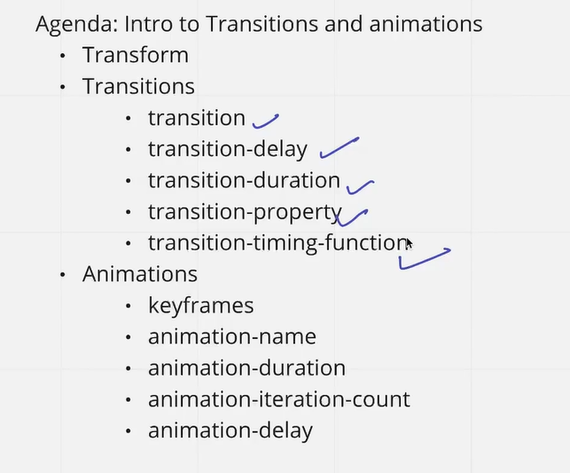

# CSS ANIMATIONS

If we want any transitions to happen, two property is very required.

1. Transition Property
2. Transition Duration (how much time will the transition take)

We can also use certain third-party libraries for using various animations and transitions and copy it.

Like - [Animate CSS](https://animate.style/)

